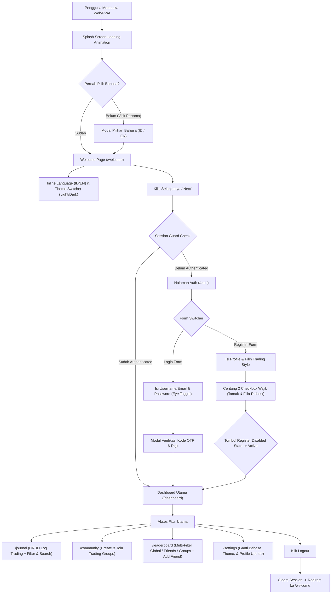

# 📊 ANALISIS SISTEM, FLOW, FITUR, KOMPONEN & LIBRARY
> **Aplikasi: KRTrade by Filla Calon Wong Sugih 9 Naga**  
> *Versi Aplikasi: BETA Version 0.0.0.1*  
> *Dokumen Hasil Audit & Analisis Arsitektur Aplikasi*

---

## 📌 Executive Summary
**KRTrade** adalah aplikasi Web-Based Trading Journal & Community (PWA) yang ultra-responsif, ringan, dan siap pakai melintasi perangkat Desktop, Laptop, Android, dan iOS. Aplikasi ini dibangun menggunakan stack modern Next.js 16 (App Router + Webpack), React 19, Google Fonts (Montserrat & Poppins), Tailwind CSS v4 (Tradewire Light Theme), Lucide Icons, Lightweight Charts, serta Supabase Backend (PostgreSQL Database & Supabase Auth) dengan fallback otomatis ke *persistent local storage*.

---

## 🔄 1. ANALISIS FLOW SISTEM & USER JOURNEY

### A. Diagram Alur Pengguna (User Journey Flowchart)

---

## 🎯 2. ANALISIS FITUR LENGKAP (FEATURES BREAKDOWN)

| Fitur | Deskripsi & Kemampuan Fitur | Status Implementation | File Utama |
| :--- | :--- | :---: | :--- |
| **Google Fonts Typography** | Montserrat (Headings/Brand) & Poppins (Body/Inputs) dikonfigurasi via `next/font/google`. | ✅ **Completed** | `src/app/layout.tsx` |
| **App Logo Component** | Komponen modular `src/components/common/AppLogo.tsx` merender `/public/logo.png` dengan SVG fallback. | ✅ **Completed** | `src/components/common/AppLogo.tsx` |
| **Splash Screen & Initial Loading** | Animasi loading awal aplikasi dengan logo pulse & indikator progress di `src/components/common/SplashScreen.tsx`. | ✅ **Completed** | `src/components/common/SplashScreen.tsx` |
| **Version Tag Update** | Seluruh tampilan label versi diperbarui secara konsisten menjadi `"BETA Version 0.0.0.1"`. | ✅ **Completed** | `src/lib/translations.ts` |
| **Welcome Page Refinements (`/welcome`)** | Kontrol pemilihan Bahasa (ID / EN) & Theme Switcher (Light / Dark Mode) langsung di halaman pendaratan. | ✅ **Completed** | `src/app/welcome/page.tsx` |
| **Auth UI/UX Refinements (`/auth`)** | Dihapusnya tombol Google OAuth, penambahan Toggle Mata Password (`Eye`/`EyeOff`), & styling placeholder profesional (opacity 50%). | ✅ **Completed** | `src/app/auth/page.tsx` |
| **Register Button Disabled Validation** | Tombol "Daftar / Register" berada dalam keadaan `disabled` (grayed out) sampai kedua checkbox wajib dicentang. | ✅ **Completed** | `src/app/auth/page.tsx` |
| **Protected Route Guard** | Middleware & listener sesi yang memproteksi halaman dashboard, journal, community, leaderboard, & settings dari akses tanpa login. | ✅ **Completed** | `src/context/AuthContext.tsx` |
| **Dashboard PnL Metrics** | Ringkasan metrik statistik: Total PnL ($), Win Rate (%), Profit Factor, Avg Risk-to-Reward (RRR), & Win/Loss Streak. | ✅ **Completed** | `src/app/dashboard/page.tsx` |
| **Equity Growth Curve** | Visualisasi grafik pertumbuhan saldo portfolio ($10,000 base) menggunakan Lightweight Canvas/SVG engine. | ✅ **Completed** | `src/components/dashboard/EquityChart.tsx` |
| **Trading Journal Log (CRUD)** | Fitur Tambah, Edit, Hapus, & Lihat Transaksi Trading lengkap tersambung ke PostgreSQL Supabase. | ✅ **Completed** | `src/app/journal/page.tsx` |
| **Community Trading Groups** | Fitur membuat grup trading baru & bergabung via kode unik 6-digit. | ✅ **Completed** | `src/app/community/page.tsx` |
| **Multi-Filter Leaderboard** | Filter Global, Friends Only, dan Community Members dengan kalkulasi PnL, Win Rate, & Total Trades. | ✅ **Completed** | `src/app/leaderboard/page.tsx` |
| **Real Add Friend System** | Modal pencarian trader berdasarkan `username`, pengiriman permintaan pertemanan, dan filter daftar teman. | ✅ **Completed** | `src/components/modals/AddFriendModal.tsx` |
| **Settings & Profile Management** | Pengatur Bahasa aplikasi (ID/EN), update Nama Lengkap, Username, & Avatar Image URL ke database `profiles`. | ✅ **Completed** | `src/app/settings/page.tsx` |
| **Mobile PWA Support** | `manifest.json` terkonfigurasi untuk Standalone App di Android & iOS dengan Bottom Navigation Bar. | ✅ **Completed** | `public/manifest.json` |

---

## 🧩 3. DAFTAR KOMPONEN & STRUKTUR HALAMAN (UI COMPONENTS)

### A. Halaman Utama (`/src/app`)
- **`src/app/page.tsx`**: Route akar yang melakukan auto-redirect ke `/welcome` atau `/dashboard`.
- **`src/app/welcome/page.tsx`**: Halaman Onboarding awal dengan inline Language & Theme controls.
- **`src/app/auth/page.tsx`**: Halaman Auth dengan Eye Password Toggle, Disabled Register Button, & Professional Placeholders.
- **`src/app/dashboard/page.tsx`**: Halaman Dashboard PnL & Equity Curve.
- **`src/app/journal/page.tsx`**: Halaman Pengelolaan Jurnal Trading Log (CRUD).
- **`src/app/community/page.tsx`**: Halaman Komunitas & Trading Groups.
- **`src/app/leaderboard/page.tsx`**: Halaman Peringkat Multi-Filter Trader.
- **`src/app/settings/page.tsx`**: Halaman Pengaturan Bahasa, Theme, & Profile.
- **`src/app/layout.tsx`**: Root Layout dengan Google Fonts Montserrat & Poppins + SplashScreen.

### B. Komponen Common & Modals (`/src/components`)
- **`src/components/common/AppLogo.tsx`**: Komponen modular logo `/public/logo.png` dengan SVG fallback.
- **`src/components/common/SplashScreen.tsx`**: Komponen animasi splash loading awal.
- **`src/components/modals/LanguageSelectorModal.tsx`**: Modal popup pilihan bahasa utama.
- **`src/components/modals/OtpModal.tsx`**: Modal popup verifikasi 6-digit OTP via email.
- **`src/components/modals/TradeModal.tsx`**: Modal form input CRUD Jurnal.
- **`src/components/modals/AddFriendModal.tsx`**: Modal pencarian user berdasarkan `username`.

---

## 📦 4. ANALISIS LIBRARY & TECH STACK DEPENDENCIES

| Library / Package | Versi | Peran Utama |
| :--- | :---: | :--- |
| **`next`** | `16.2.12` | Framework Next.js App Router. |
| **`react`** & **`react-dom`** | `19.2.4` | Core React 19 Engine. |
| **`@supabase/supabase-js`** | `^2.111.0` | Supabase SDK untuk Auth & PostgreSQL DB. |
| **`lucide-react`** | `^1.28.0` | Icons library (`Eye`, `EyeOff`, `Sun`, `Moon`, `Crown`, dll). |
| **`lightweight-charts`** | `^5.2.0` | TradingView Financial Charts. |
| **`tailwindcss`** | `^4.0.0` | Tailwind CSS v4 Engine. |
